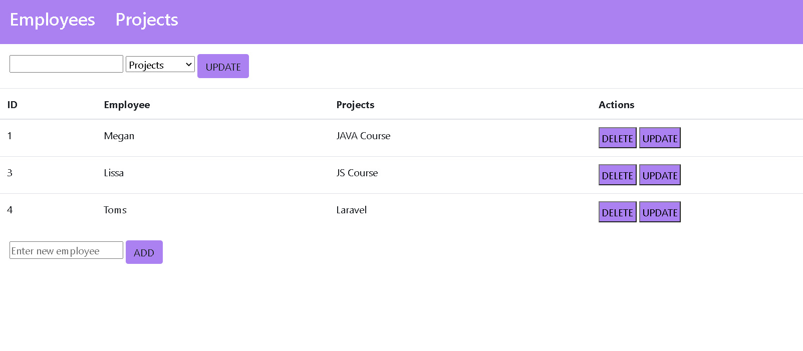

# ProjectManager
This crud app  allows you to create/delete or update  employees or project.
For this project were used technologies:
- PHP 7.3,
- MySQL,
- SASS,
- HTML.

## How to run
- Install ampps/wamp/xampp, MySQL and MySQL Workbench in your computer. If you don't know how to install 'ampps', 'MySQL Workbench' or 'MySQL' follow this links: 
- <a href="https://www.ampps.com/wiki/Install">Ampps download</a>;
- <a href="https://dev.mysql.com/downloads/installer/">MySQL download</a>;
- <a href="https://dev.mysql.com/downloads/workbench/">MySQL Workbench download</a>;

- Run ampps/wamp/xampp. 

- Download or clone this repository. 

- Extract downloaded files and move to 'C:/Program Files/Ampps/www'. 

- Run MySQL Workbench. Then create new MySQL connections and insert dump.sql file.

- Go to browser using this link: http://localhost/Sprintas2 gitRep/

Now you should see my crud app like this :

